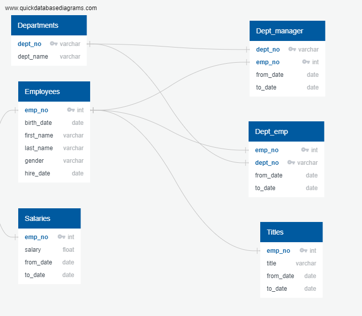
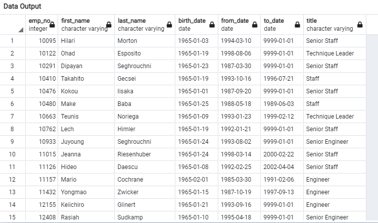

# Pewlett-Hackard-Analysis

## Overview/Purpose:
The purpose of this project was to build an employee database to better organize the employee data that had been stored in six seperate csv files. THe Creation of the Database allowed us to easily identify employees who are eligiable for retirement. 
###Deliverable 1 and Deliverable 2 called for us to determine the number of retiring employees per title, and identify employees who are eligible to participate in a mentorship program.

## Results:
* We were able to create an efficent database based on the ERD we created:   
* We were able to create a new table in the database that listed employees (by title) that were eligible for retirement. This was determined based on the employees birthdate.

* The retirement table we created contained duplicates because one employee could have multiple titles over the span of a career. Using the employee's most recent title, we created a Unique table to correct this issue:

* We then leveraged the unique title table to create a table that counted the number of employees eligible to retire sorted by title. 

* In addition to the retirement data, we were asked to created a table to determine the employees who are eligible for a mentorship. 

## Summary
### The data clearly showed that Pewlett-Hackard has a very big turn-over problem coming in the near future. We could dice up the data further help them with a contingency plan. 
* Using our database we could breakdown the number of employees eligible to retire by department.
* We could also show the number over new hires annually.
* We could estimagte the number of new hires needed going forward.
